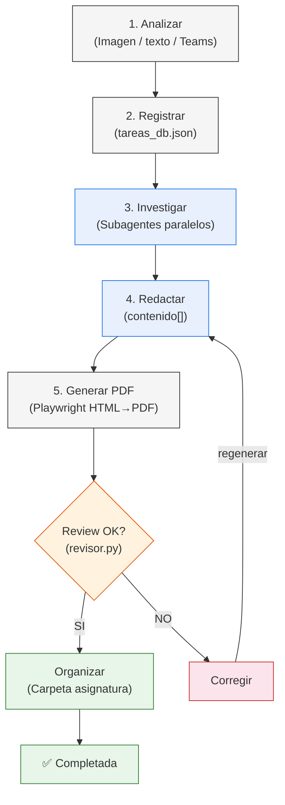
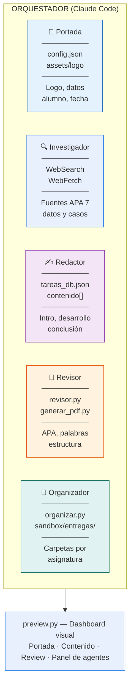
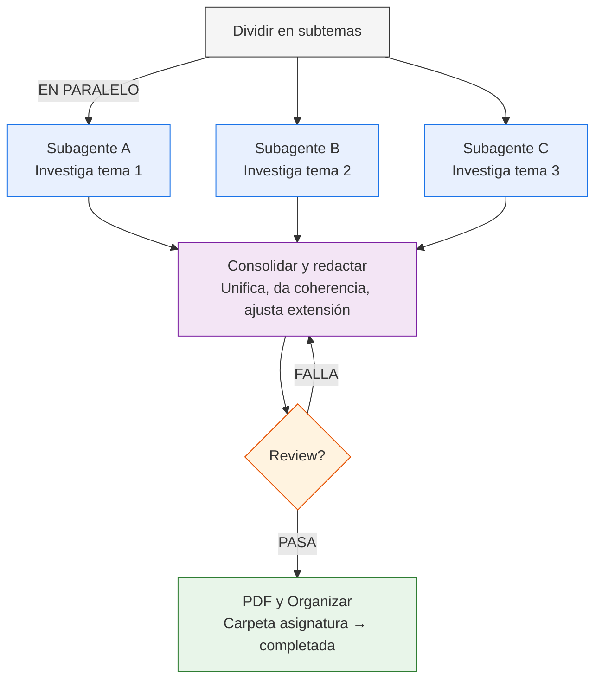

# Sistema Agéntico UTM — Arquitectura

Cómo funciona el sistema de tareas escolares con agentes autónomos: pipeline, review y orquestación paralela.

## Pipeline completo



Un solo comando ejecuta todo: analiza la tarea, la registra, investiga con subagentes en paralelo, redacta el contenido, genera el PDF con Playwright, pasa el review automático y organiza el archivo en la carpeta de su asignatura. Si el review falla, corrige y regenera hasta que pase.

```bash
python gestor.py flujo <id>           # Pipeline completo
python preview.py pipeline <id>       # Pipeline con status visual
```

## Panel de agentes



Cada agente reporta su estado (**OK**, **Requiere acción**, **Fallas**) con instrucciones exactas de qué arreglar y en qué archivo. El Revisor es la compuerta: si detecta fallas, el Redactor recibe instrucciones específicas de qué corregir, y el pipeline vuelve a generar.

```bash
python preview.py <id> agentes    # Ver estado de cada agente
```

## Orquestación con subagentes



Para tareas de más de 1,000 palabras, el orquestador divide el tema en subtemas y lanza un subagente de investigación por cada uno en paralelo. Los resultados se consolidan en una redacción coherente, y el revisor valida contra los criterios de evaluación. Si falla, el loop corrige y regenera hasta que pase.

| Fase | Qué hace | Herramienta |
|---|---|---|
| 1. Investigación | Subagentes buscan fuentes por subtema | Agent tool + WebSearch |
| 2. Redacción | Unifica hallazgos, ajusta tono y extensión | Claude main + gestor.py |
| 3. QA | Valida APA, estructura, palabras, archivo | revisor.py + preview.py |

## Herramientas CLI

| Comando | Qué hace |
|---|---|
| `python gestor.py flujo <id>` | Pipeline completo: PDF → Review → Organizar → Completar |
| `python gestor.py resumen --json` | Estado de todas las tareas (JSON) |
| `python gestor.py alertas --json` | Tareas próximas a vencer (JSON) |
| `python generar_pdf.py <id>` | Solo generar PDF (portada PIL → HTML → Playwright) |
| `python revisor.py <id>` | Solo review de calidad |
| `python revisor.py <id> --json` | Review en JSON para parsing agéntico |
| `python organizar.py setup` | Crear carpetas por asignatura |
| `python organizar.py mover` | Mover archivos sueltos a sus carpetas |
| `python organizar.py estado --json` | Estado de organización (JSON) |
| `python preview.py <id>` | Dashboard visual completo |
| `python preview.py <id> agentes` | Panel de agentes con instrucciones |
| `python preview.py pipeline <id>` | Pipeline en vivo con barra de progreso |
