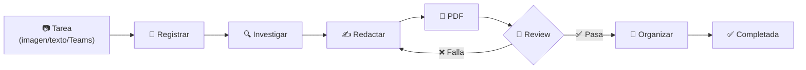
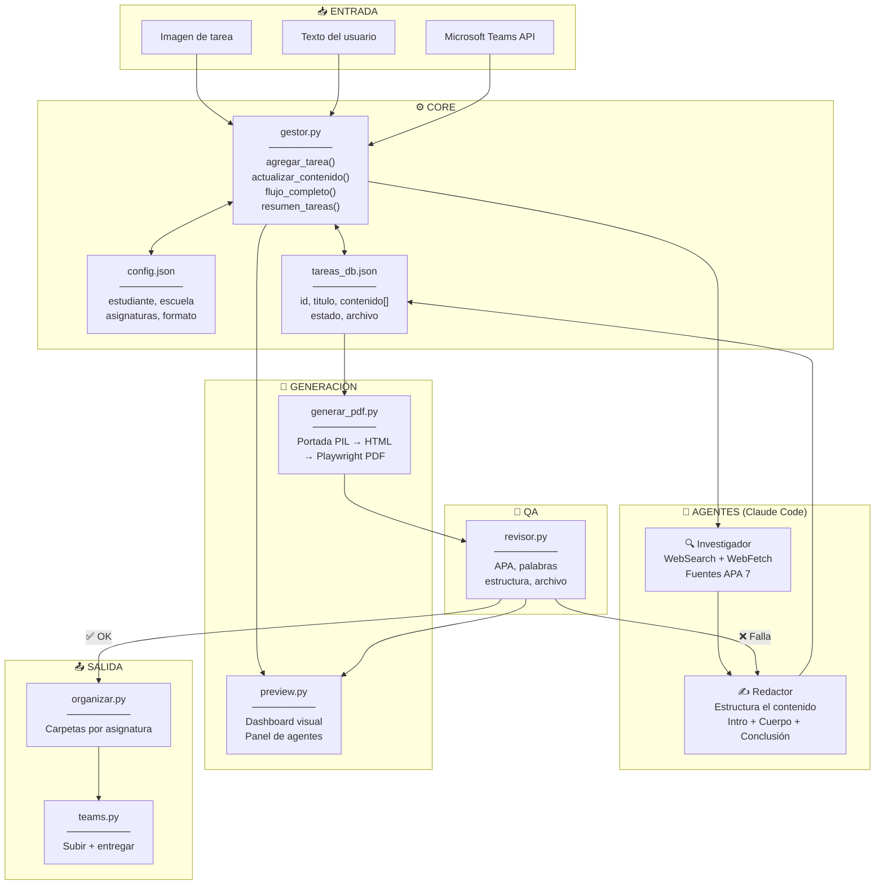

# Task — Sistema de Tareas Escolares UTM

Sistema agéntico para gestionar tareas escolares, generar documentos con portada institucional y sincronizar con Microsoft Teams. Claude Code orquesta todo el flujo de forma autónoma: investiga, redacta, genera PDF, valida calidad y organiza entregas.

## Arquitectura

```
task/
├── gestor.py              # Motor principal: CRUD, pipeline PDF→Review→Organizar
├── generar_pdf.py         # Portada PIL + HTML → PDF con Playwright (<5s)
├── revisor.py             # Validador automático: APA, estructura, palabras
├── organizar.py           # Gestión de carpetas por asignatura
├── preview.py             # Dashboard visual con Rich (agentes, review, portada)
├── teams.py               # Integración Microsoft Teams vía Graph API
├── config.json            # Datos del estudiante, escuela, asignaturas, formato
├── tareas_db.json         # Base de datos de tareas (JSON)
├── CLAUDE.md              # Instrucciones agénticas para Claude Code
├── ARQUITECTURA.md        # Diagramas del sistema (Mermaid)
├── assets/                # Logo UTM y recursos
└── sandbox/entregas/      # Documentos organizados por asignatura
    ├── Etica y Legislacion en TI/
    ├── Base de Datos en la Nube/
    └── Fundamentos de IA/
```

## Workflow agéntico

Cuando se asigna una tarea, Claude Code orquesta todo automáticamente con subagentes en paralelo:



### Pipeline completo (`python gestor.py flujo <id>`)

```
Tarea asignada
  │
  ├─ 1. Analizar ──────── ¿Qué se pide? (imagen, texto, Teams)
  ├─ 2. Registrar ─────── tareas_db.json con agregar_tarea()
  │
  ├─ 3. Investigar ────── Subagentes EN PARALELO
  │     ├─ Subagente A ── Investiga subtema 1 (WebSearch)
  │     ├─ Subagente B ── Investiga subtema 2 (WebSearch)
  │     └─ Subagente C ── Investiga subtema 3 (WebSearch)
  │
  ├─ 4. Redactar ──────── Consolida hallazgos → contenido[]
  ├─ 5. Generar PDF ───── Portada PIL → HTML → Playwright (<5s)
  │
  ├─ 6. Review ────────── revisor.py valida:
  │     ├─ ✅ Conteo de palabras
  │     ├─ ✅ Introducción + Conclusión
  │     ├─ ✅ Referencias APA 7
  │     ├─ ✅ Estructura (secciones mínimas)
  │     └─ ✅ Archivo generado (tamaño, formato)
  │
  │     ¿Pasa? ─── SI → continuar
  │               NO → corregir contenido → volver a paso 4
  │
  ├─ 7. Organizar ─────── Mover a carpeta de asignatura
  └─ 8. Completar ─────── Marcar como completada en DB
```

### Comunicación entre componentes



## Panel de agentes

Cada agente tiene responsabilidades específicas y sabe exactamente qué archivos tocar:

| Agente | Responsabilidad | Archivos | Estado |
|--------|----------------|----------|--------|
| 🎨 **Portada** | Logo, datos del alumno, fecha | `config.json`, `assets/` | OK / Requiere acción |
| 🔍 **Investigador** | Buscar fuentes, ampliar contenido | WebSearch, WebFetch | OK / Requiere acción |
| ✍️ **Redactor** | Estructura, intro, conclusión, coherencia | `tareas_db.json` → `contenido[]` | OK / Requiere acción |
| 🔎 **Revisor** | APA 7, conteo de palabras, formato, archivo | `revisor.py` | Aprobado / Fallas |
| 📁 **Organizador** | Carpetas por asignatura, mover archivos | `organizar.py`, `sandbox/entregas/` | OK / Requiere acción |

Ver el panel en vivo:
```bash
python preview.py <id> agentes
```

## CLI

```bash
# Activar entorno
source .venv/bin/activate

# === Pipeline completo ===
python gestor.py flujo <id>              # PDF → Review → Organizar → Completar
python preview.py pipeline <id>          # Lo mismo, con barra de progreso visual

# === Gestión de tareas ===
python gestor.py listar [estado] [asig]  # Listar tareas
python gestor.py agregar <asig> <titulo> # Crear tarea
python gestor.py estado <id> <estado>    # Cambiar estado
python gestor.py resumen                 # Vista general
python gestor.py alertas                 # Tareas próximas a vencer

# === Generación ===
python generar_pdf.py <id>               # Solo generar PDF
python generar_pdf.py <id> --abrir       # Generar y abrir

# === Review de calidad ===
python revisor.py <id>                   # Validar una tarea
python revisor.py <id> --criterios '{"min_palabras": 1500}'
python revisor.py todos                  # Validar todas las activas

# === Organización ===
python organizar.py setup                # Crear carpetas por asignatura
python organizar.py mover                # Mover archivos sueltos
python organizar.py estado               # Ver estado de organización

# === Preview / Dashboard ===
python preview.py <id>                   # Dashboard completo
python preview.py <id> portada           # Solo portada
python preview.py <id> contenido         # Outline con conteo de palabras
python preview.py <id> review            # Solo review de calidad
python preview.py <id> agentes           # Panel de agentes

# === Modo JSON (para parsing agéntico) ===
python gestor.py resumen --json
python gestor.py alertas --json
python revisor.py <id> --json
python organizar.py estado --json

# === Teams ===
python teams.py login                    # Autenticación
python teams.py revisar                  # Ver tareas pendientes
python teams.py subir <class> <assign> <archivo>
python teams.py entregar <class> <assign>
```

## Formato de contenido

```json
[
  {"tipo": "titulo", "texto": "Introducción"},
  {"tipo": "parrafo", "texto": "Texto del párrafo..."},
  {"tipo": "subtitulo", "texto": "Sección 2"},
  {"tipo": "lista", "items": ["Item 1", "Item 2"]}
]
```

## Requisitos

```
python-docx  Pillow  msal  requests  playwright  rich  click
```

## Sandbox

El directorio `sandbox/` es el workspace local donde se guardan las entregas generadas. No se sube al repositorio — cada instalación genera sus propios documentos. Las carpetas se crean automáticamente con `python organizar.py setup`.
